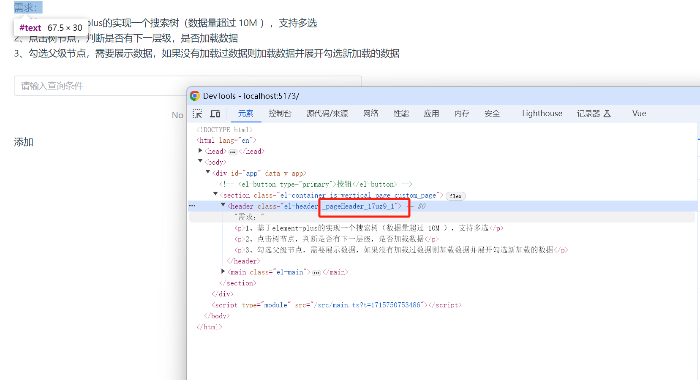

## Project Setup

```sh
pnpm install
```

### Compile and Hot-Reload for Development

```sh
pnpm dev
```

### Type-Check, Compile and Minify for Production

```sh
pnpm build
```

### Lint with [ESLint](https://eslint.org/)

```sh
pnpm lint
```

### 这个项目引入的是element-plus 组件库

#### vue3 + tsx 中如何实现 style scope
常规 vue template 写法，在style 上标识 scope 
```vue
  <template>
    <div class="test"></div>
  </template>
  <style scope>
    .test {

    }
  </style>
```
在 tsx 中没有scope的说法，但是可以用 style module
```tsx

  import style from './test.module.scss'
  defineComponents（{
    setup () {
      return () => (
        <div class={style.test}></div>
      )
    }
  }）
```



增加提示:

- 安装 `typescript-plugin-css-modules`: **`npm install typescript-plugin-css-modules --save-dev`** 
- 在 `tsconfig.json` 中添加配置  `"plugins": [{"name": "typescript-plugin-css-modules"}]`
- 在 .vscode/setting中添加配置 
``` json
{
  "typescript.tsdk": "node_modules/typescript/lib",
  "typescript.enablePromptUseWorkspaceTsdk": true
}
```